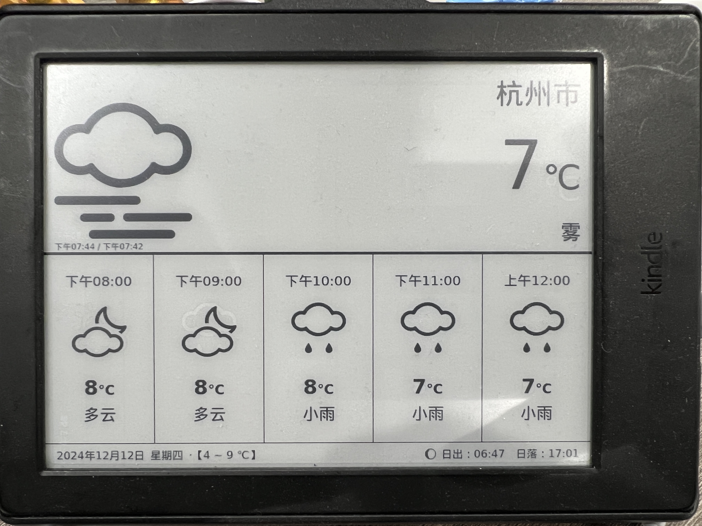
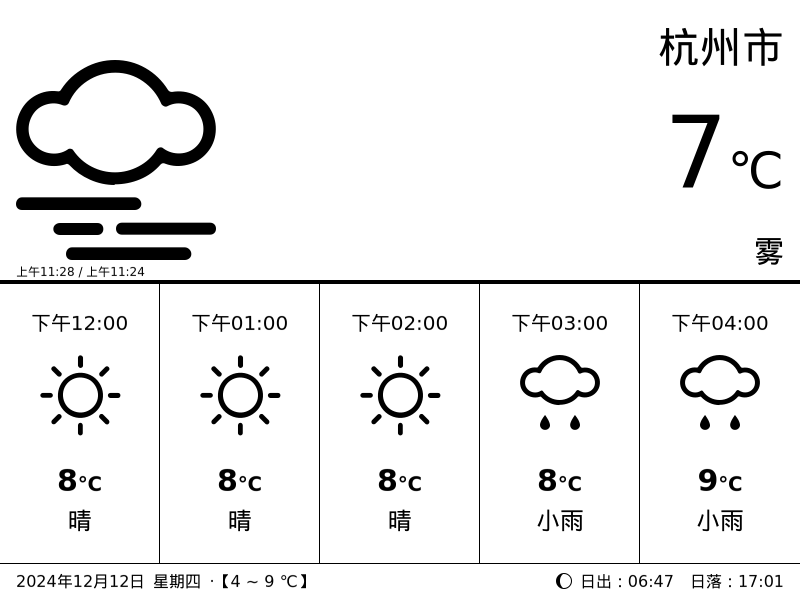

# Kindle 天气预报

使用自己的 Kindle 展示天气预报。

## 介绍

这是一个用 Kindle 墨水瓶展示展示天气的应用。





在线预览: [https://kindle.mofada.cn?key=api_key&location=location&city=city](https://kindle.mofada.cn?key=api_key&location=location&city=city)

在线截图: [https://kindle.mofada.cn/screenshot?key=api_key&location=location&city=city](https://kindle.mofada.cn/screenshot?key=api_key&location=location&city=city)

| 参数       | 说明                                                                                                              |
|----------|-----------------------------------------------------------------------------------------------------------------|
| api_key  | 和风天气的 [api_key](https://dev.qweather.com/docs/authentication/apikey/)                                           |
| location | 需要查询地区的名称，支持文字、以英文逗号分隔的经度,纬度坐标（十进制，最多支持小数点后两位）、LocationID或Adcode（仅限中国城市）。例如 location=北京 或 location=116.41,39.92 |
| city     | 城市名称                                                                                                            |

## 使用方法

> 首先你需要对你的Kindle进行越狱，然后安装 KUAL。关于如何越狱和安装
> KUAL，请参考[这里](https://bookfere.com/post/406.html)。

越狱后你需要安装对应的插件[KUAL](https://www.mobileread.com/forums/showthread.php?t=203326)、[USBNet](https://bookfere.com/post/406.html)。

可以参考这个[Kindle 越狱插件资源下载及详细安装步骤]([KUAL](https://www.mobileread.com/forums/showthread.php?t=203326))。

安装好插件后，将本项目下载到本地，然后修改[helper.ts](packages/kindle-dashboard/src/api/helper.ts)
中的`API_KEY`和`LOCATION`,换成你实际的数据。

然后将项目打包，将打包后的文件夹拷贝到 [weather](packages/kindle-server/weather) 目录下。

最后将 `kindle-server` 部署到你的服务器上。

更新 `kindle-bash` 中 `start.sh` 中的 url 信息

### 启动定时任务

```shell
# 将根文件系统重新挂载为可写
mntroot rw

# 编辑 /etc/crontab/root 文件
nano /etc/crontab/root

# 修改完成后，将根文件系统重新挂载为只读
mntroot ro


# 停止 crond 服务
pkill crond

# 启动 crond 服务
busybox crond
```
